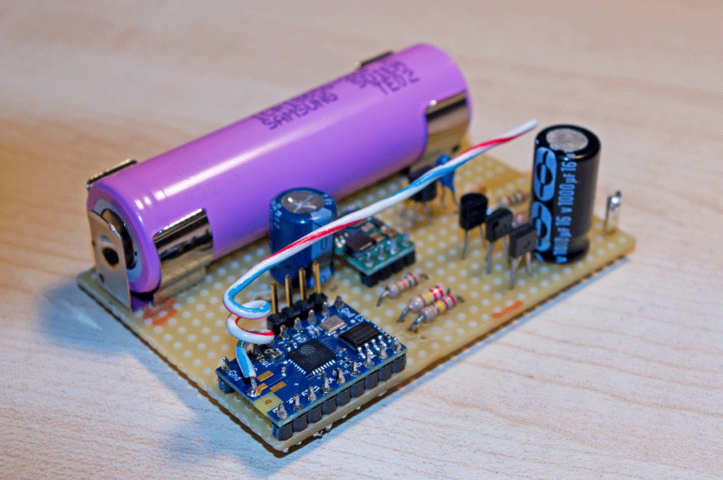
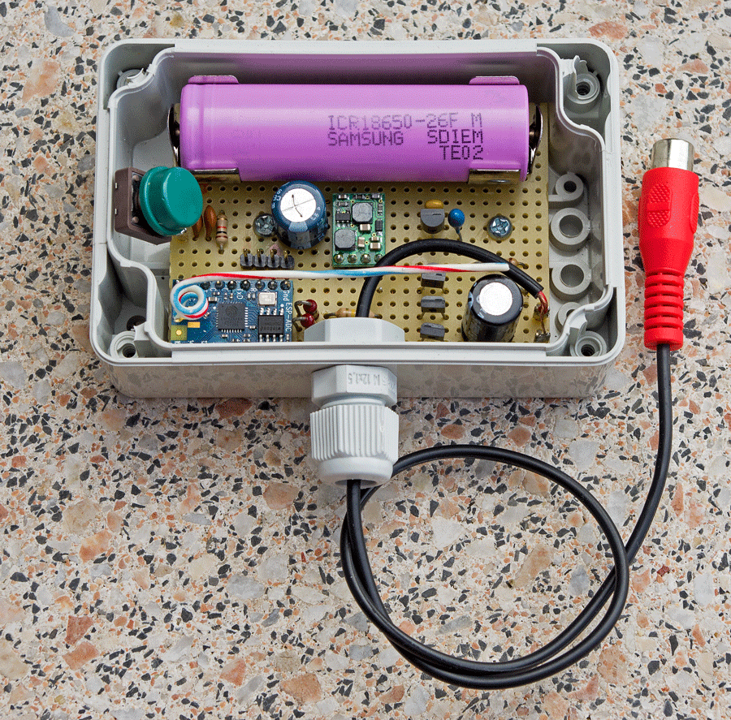

# ESP8266-Gardena1251 - WLAN control unit for the Gardena 9V irrigation valve no. 1251 #

This project is a proof of concept applied to a practical purpose, especially regarding the following aspects: 

- power consumption of the ESP8266 can be reduced to allow continuous operation over several months with a 2600 mAh battery
- real time keeping is possible without an RTC
- using a TCP client improves network security 

The firmware is intended for an Espressif ESP8266 SoC to control the Gardena solenoid irrigation valve no. 1251 via WLAN. The management network protocol uses JSON for all telegrams.

*******************************************************************************

** WARNING: **

Because this project is geared to be used with a latching solenoid irrigation valve, an inherent danger of flooding exists in case of control unit operation errors or misconfiguration. The valve is not intrinsically safe because it will not close by itself when power fails. On the other hand the WLAN control unit cannot "see" the true state of the valve and cannot take countermeasures in case of a discrepancy.

Therefore: ** Using this project is COMPLETELY AT YOUR OWN RISK! **

*******************************************************************************

## Hardware ##

To use this project as intended a specific control unit hardware including an ESP8266 SoC with waterproof casing is required. The material costs for the control unit are around 100 EUR and good electronic and mechanical skills are required for successfully manufacturing the control unit.

No reverse engineering was necessary for interfacing with the Gardena solenoid valve no. 1251 because the necessary facts have been published quite a while ago, e.g. in the [Symcon forum](https://www.symcon.de/forum/threads/41-Gardena-Gartenbew%C3%A4sserung#2) in 2005. A discussion in the [mikrocontroller.net forum](http://www.mikrocontroller.net/topic/230065) from 2011 about solenoid drivers ciruits using relays or bipolar transistors gave me the idea to use MOSFET transistors instead.

 

 

## Firmware ##

Before deciding to design the firmware from scratch I considered using the [NodeMCU Lua Firmware](https://github.com/nodemcu/nodemcu-firmware). The one reason that tipped the scales was the goal to maximize battery life as much as possible - and then every code line counts. The basics where already working about 2 weeks before Espressif Systems published the [Low Power Voltage Measurement Project](https://github.com/EspressifSystems/low_power_voltage_measurement), but it was nice to be confirmed that the good old RTC CMOS RAM can still be used for the IoT. 

#### Build Environment ####

The firmware was build using 

- the [Unofficial Development Kit for Espressif ESP8266](https://github.com/CHERTS/esp8266-devkit) 
- with [Eclipse Luna](https://eclipse.org/luna/)
- using the [Espressif ESP8266 SDK 1.3.0](http://bbs.espressif.com/) 
- and a Makefile based on the example in the book [Kolban's Book on ESP8266](http://neilkolban.com/tech/esp8266/)

Special credits to Mikhail Grigorev "CHERTS" for the seamless integration of the ESP8266 toolchain with Eclipse.

#### Configuration ####

Currently the WLAN access point configuration and the IP address and port of the management service must be set in the file _user___config.h_ before building the firmware. In a future release this configuration will be done by WLAN without the need of changing the firmware. 

## Management Service ##

By running a specifically tailored service in your network you can manage the operation of one or more WLAN control units. It is intentional that the WLAN control unit acts as TCP client and not as TCP server. This approach is slightly off in respect to many current IoT examples but hacking the WLAN control unit over the network will be a little bit more difficult this way. 

## Conclusions ##

This project is a proof of concept so there should be some results after about 6 months of development and testing and here they are:
 
- The control unit can operate at least 3 months on a 18650 lithium-ion battery when using a WLAN wakeup cycle of 15 minutes. As expected, the theoretical value of about 12 months continuous operation was not reached. There are several reasons for this, e.g. a higher average consumption of the circuit in real life than on the breadboard and the self discharge of the battery. This result is still good in respect to the greediness of the ESP8266 but it is bought with the loss of just-in-time valve control. 

- The low battery detection/notification combined with a valve operation shutdown kicked in about a week before the battery was completely drained. To avoid damage to the battery in such a case, a full shutdown of the circuit is desired until the battery can be replaced. 

- Even when using the ESP8266's deep sleep mode that disables the RTC, real time keeping is still possible at reduced accuracy. The deep sleep timer of the ESP8255 has a tendency to wakeup about 3.75% earlier than should be expected. This deviation can be calibrated with some test runs and taken into account, yielding an acceptable absolute accuracy of a few minutes per day. Combining real time with a week timer, the control unit can operate without contact to the management service and a temporary WLAN link loss will not affect scheduled operations.

- Employing a lambda/2 wire as antenna inside the control unit case and placing it a few centimetres below ground does not improve WLAN reception. This can be a reason for a higher battery drain because connecting to the management service takes longer or fails altogether. Using an external WLAN antenna with 6dBi gain and placing it a few centimetres above ground has improved the reliability of the WLAN link significantly. If this saves or cost battery life is hard to determine without measurement.

- There is no suitable way for the control unit to detect the state of the solenoid valve. One way to make sure that the valve is closed when it should be would be to try to close it periodically every few seconds but this way of operation would drain the battery very quickly.

- The overall reliability of the control unit proofed to be much better than expected. After initial adjustments to the solenoid driver circuit no loss of control was observed. 

## Licenses ##

#### Firmware ####
  
Copyright (c) 2015 jnsbyr  
Apache 2.0 License
 
The firmware source code depends on: 

#### Espressif ESP SDK 1.3.0 ####
  
Copyright (c) 2015 <ESPRESSIF SYSTEMS (SHANGHAI) PTE LTD>  
ESPRSSIF MIT License  
http://bbs.espressif.com/
    
see LICENSE file for more details
